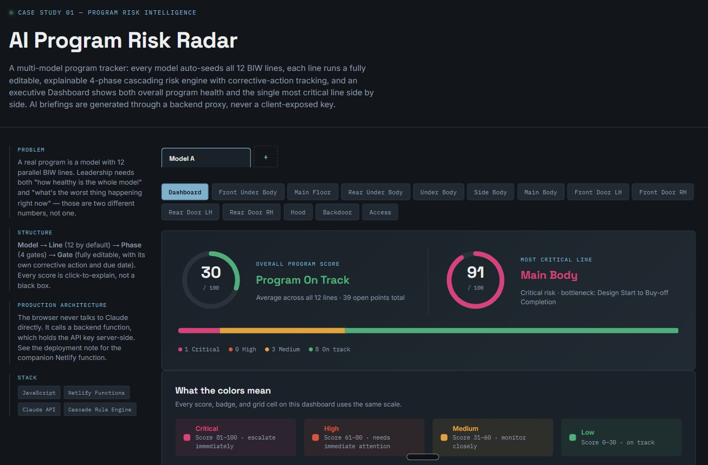
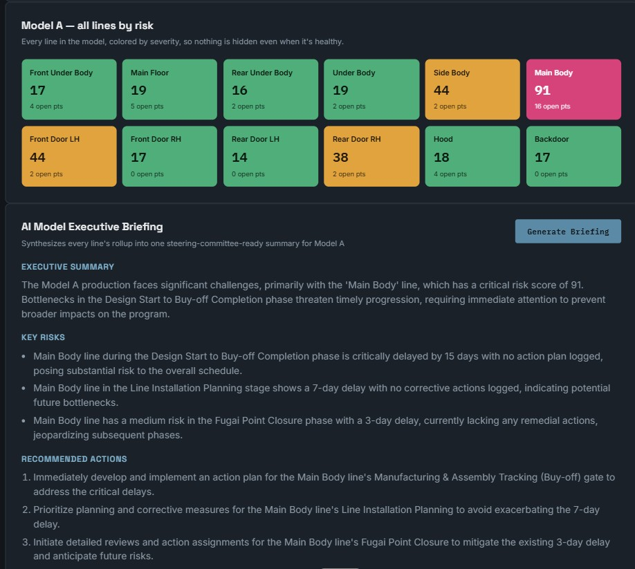
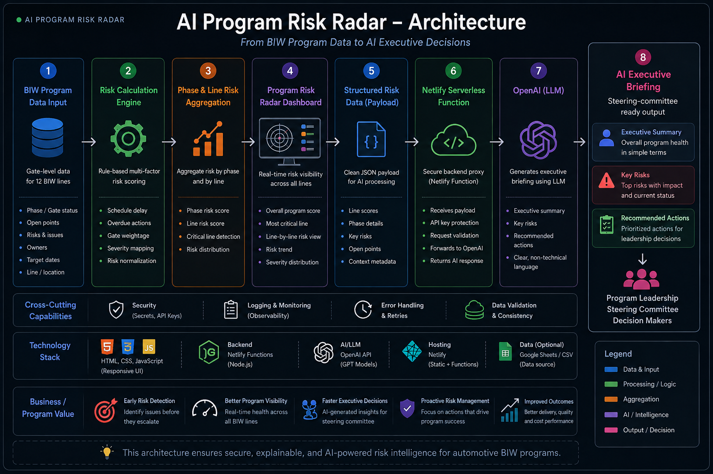

# AI Program Risk Radar

AI-enabled program risk management and executive decision-support platform for automotive BIW programs.



## 🚀 Live Demo

https://ai-program-model-risk-radar.netlify.app

---

## 📌 Project Overview

Large automotive BIW programs involve multiple manufacturing lines, phases, gates, suppliers, schedule commitments, quality issues and corrective actions.

The challenge is not only tracking these data points, but identifying:

- Which risks are most critical?
- Which phase is becoming the bottleneck?
- Which risks are cascading into downstream activities?
- Which high-risk items have no corrective action?
- What should program leadership focus on immediately?

AI Program Risk Radar converts gate-level program data into a consolidated risk view and generates an AI-powered executive briefing for steering-committee decision making.

---

## 🎯 Key Capabilities

### 1. Gate-Level Risk Assessment

Evaluates individual program gates using:

- Schedule slippage
- NG / quality points
- Maker readiness
- Gate criticality
- Corrective-action status

### 2. Cascading Risk

Risk inherited from preceding gates is incorporated into downstream gate risk, helping identify risks that may propagate through the program.

### 3. Phase-Level Risk

Each program phase is summarized using its highest gate risk, allowing management to quickly identify phase bottlenecks.

### 4. Program-Level Risk View

Multiple BIW lines can be evaluated and ranked by risk severity.

### 5. Corrective-Action Tracking

Each gate supports:

- Corrective action
- Action due date
- Action status visibility

High/medium-risk items without logged corrective actions are specifically surfaced for management attention.

### 6. AI Executive Briefing

The AI layer converts structured program risk data into:

- Executive summary
- Key risks
- Recommended actions

The briefing is designed for steering-committee-level communication rather than raw technical data.



---

## 🏗️ AI Architecture



---

## 🏭 Automotive BIW Use Case

The application is designed around a typical BIW program execution environment covering:

1. Commercial Plan
2. Design Start to Buy-off Completion
3. Design / Buy-off related milestones
4. Line Installation, Fugai Closure, Trials & Production Handover

The model can be adapted for different programs, lines, suppliers and gate structures.

---

## 🧠 Risk Model

The gate risk score considers multiple signals:

```text
Schedule Slip
      +
NG / Quality Points
      +
Readiness Gap
      +
Critical Gate Weight
      +
Inherited Cascade Risk
      ↓
Total Gate Risk Score
      ↓
Risk Level
